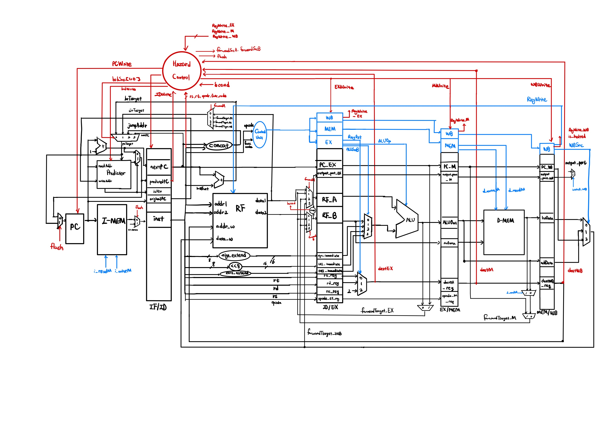
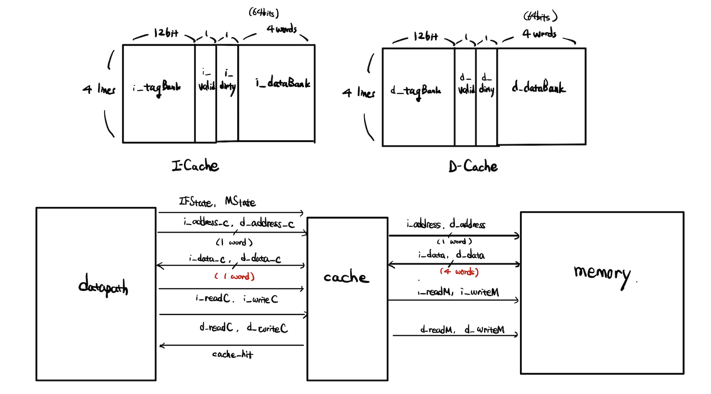
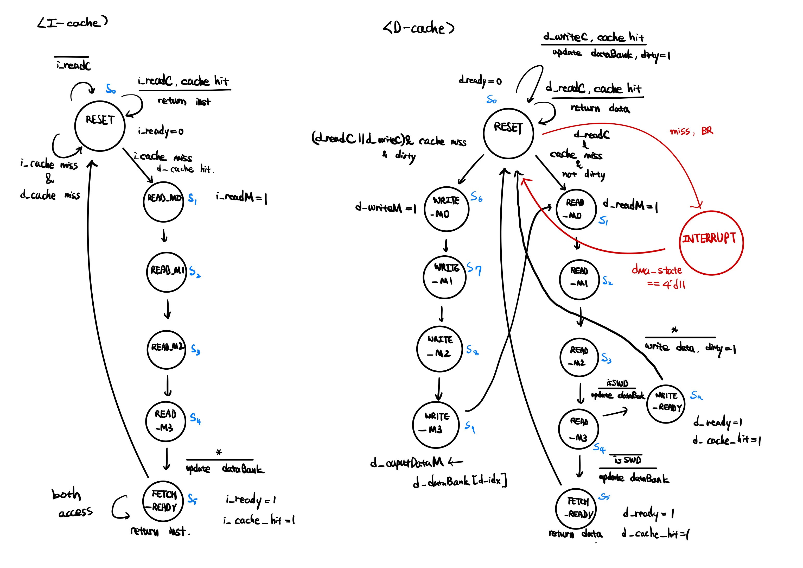
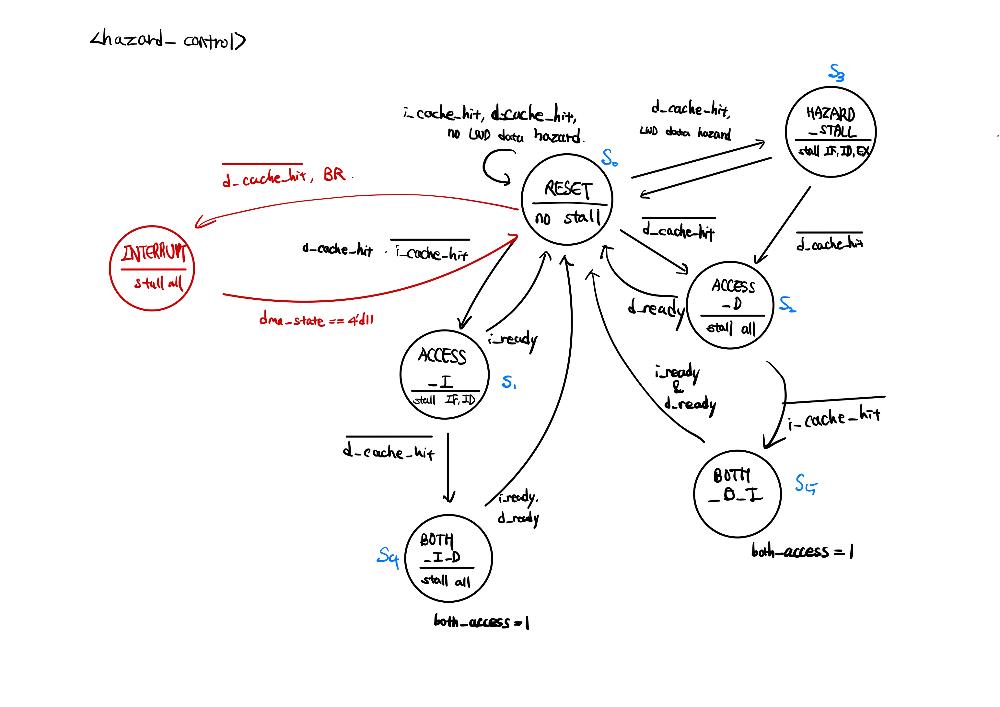

# CPU Design & RTL Simulation

A complete TSC CPU architecture implementation with advanced performance optimization features, designed and simulated using Verilog HDL.

## Project Overview

This project implements a fully functional CPU from the ground up, featuring a complete datapath and control unit design.
The architecture is enhanced with modern performance optimization techniques including pipelining, caching, DMA operations, and branch prediction.

## Key Features

### Performance Enhancements

- **5-Stage Pipeline**: Fetch, Decode, Execute, Memory, Writeback stages
- **Cache Memory System**: Optimized memory hierarchy for improved access times
- **DMA Controller**: Direct Memory Access for efficient data transfer
- **Branch Predictor**: Dynamic branch prediction to reduce pipeline stalls

## 📊 Performance Results

- **Pipeline Efficiency**: Achieved significant speedup through 5-stage pipelining
- **Cache Hit Rate**: Optimized cache design for improved memory access patterns
- **Branch Prediction Accuracy**: Enhanced instruction throughput with dynamic prediction

## Course Context

This project was developed as part of a Computer Organization course at Seoul National University,
demonstrating practical implementation of theoretical computer architecture concepts including:

- CPU design principles
- Memory hierarchy optimization
- Performance enhancement techniques
- Hardware description language proficiency

## Diagrams

<figure>
    
    <figcaption>Figure 1: Computer Architecture</figcaption>
</figure>
<figure>
    
    <figcaption>Figure 2: Memory Hierarchy & Cache Design</figcaption>
</figure>
<figure>
    
    <figcaption>Figure 3: FSM Diagram of Cache</figcaption>
</figure>
<figure>
    
    <figcaption>Figure 4: FSM Diagram of Hazard Controller</figcaption>
</figure>

---

**Course**: Computer Organization  
**Institution**: Seoul National University  
**Language**: Verilog HDL
